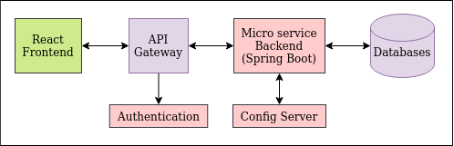

# java-web-app

This is a full stack java application built with multiple technology stack.

| Component | Descriptions |
| --- | --- |
| React Frontend | React Application coded in **typescript** and bundled using **webpack**. The app is designed using Elastic-UI, CSS Modules, SASS and Custom Component Library. End-to-End testing is done using **Cypress**. |
| Component Library | Custom React Reusable Component Library coded in **typescript** and bundled using **rollup**. The library is built using Material-UI, CSS Modules, SASS and etc... Functional testing is done using **React Testing Library**. Components can be viewed on **storybook** |
| Micro Frontend | React Application coded in **typescript** and bundled using **webpack**. Making using of Module Federation in Webpack 5, it allows the main frontend app to consume components exposed from this application. |
| Config Server | **Spring Cloud Config Server** |
| Microservices | Bunch of Microservices coded using **Spring Boot** coded in **Kotlin**. Refer to documentation below for more details... |
| API Gateway | Api Gateway deployed on **Nginx** |
| Mongo DB | database for storing data |

## Architecture

### High Level Overview

### In Depth Design Concepts

1. [Frontend](app-frontend-react/README.md) 
2. [Microservice Backend](app-backend/README.md)
3. [API Gateway](app-backend/web-api-gateway-nginx/doc/API_GATEWAY_DESIGN.md)
4. [Websocket Implementation](app-backend/ms-notification-service/doc/NOTIFICATION_SERVICE.md#websocket-server-to-client-communication)
5. Message Queue
6. Logging
7. Authentication
8. Kubernetes

## Apps / Services / API

- **Apps / Services**
    - **6006** -- Storybook ([React Component Library](app-frontend-react/react-component-library/README.md))
    - **7001** -- Microservice ([Web Service](app-backend/ms-web-service/README.md))
    - **7002** -- Microservice ([Notification Service - WebSocket](app-backend/ms-notification-service/README.md))
        - [WebSocket Topics](app-backend/ms-notification-service/doc/NOTIFICATION_SERVICE.md#topics)
    - **8080** -- [React Web App](app-frontend-react/react-base-app/README.md)
    - **8888** -- [Cloud Config Server](app-backend/ms-config-server/README.md)
    - **9090** -- [API Gateway](app-backend/web-api-gateway-nginx/README.md)
    - **15672** -- [RabbitMQ](app-backend/rabbitmq/README.md)
- **API Endpoints**
    - **Web Service**
        - [Announcements](app-backend/ms-web-service/doc/ANNOUNCEMENT_SERVICE.md)

## Quick Start

Before you can run this project, please follow the instructions on how to [set up your project environment](doc/PROJECT_SETUP.md).

### Docker-Compose

### Helm Chart?

## Contributions

If you are keen on making contributions. Please adhere to the following rules:
1. Create a branch / fork 
2. Create a pull request to merge your codes to master
3. **DO NOT** edit the master branch directly

## Documentations

### Relevant Materials

- [Writing Test using react-testing-library](app-frontend-react/react-component-library/doc/TESTING_USING_REACT_TESTING_LIBRARY.md)
- [Webpack Configuration](app-frontend-react/react-base-app/doc/WEBPACK.md)

### Misc / Just for Knowledge

- [IntelliJ set up](doc/PROJECT_SETUP.md)
- [Setting up Gradle for Multi Project](doc/GRADLE_TIPS.md)
- [Create custom reusable React component Library](app-frontend-react/react-component-library/doc/CREATE_NEW_LIBRARY.md)
- [React Micro Frontend Experiments](https://github.com/awarenessxz/react-micro-frontend)
