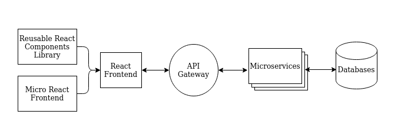

# java-web-app

Experimenting with a Java Web Application built with the following components
- **Frontend**
    - **React Frontend** (Main Frontend App)
    - **Custom React Reusable Component Library**
    - **Micro Frontend** (to be loaded into main frontend)
- **Backend**
    - **Config Server as a Microservice** (with feature toggle)
    - **Microservices**
- **Infrastructure**
    - **Message Queues**
    - **Databases**



## Folder Structure

**Note: Do ignore folders with asterisk as they are just experimental projects!!**

```
root    
├── ms-admin-service            # Micro-service (centralized admin services)
├── react-component-library     # Custom React Reusable Component Library
├── react-frontend              # Main Frontend App
├── react-micro-frontend        # Sub Frontend that is consumes by main frontend app  
├── web-api-gateway-node*       # API Gateway (Node)
└── ws-fake-api*                # Web Service (Node)
```

## Useful commands

1. Gradle
    - Inside Root Directory: `gradlew projects` --> list all projects
    - `gradlew tasks --all` --> show all tasks available

## Project Set up

### Environment Setup

1. [Install Gradle](https://gradle.org/install/#manually)
2. [Install IntelliJ](https://www.jetbrains.com/help/idea/installation-guide.html#toolbox)
3. [Install Node-12](https://github.com/nodejs/help/wiki/Installation)
4. [Install Git](https://git-scm.com/book/en/v2/Getting-Started-Installing-Git)
5. [Install Java JDK 11](https://www.oracle.com/java/technologies/javase-jdk11-downloads.html)
6. [Install Docker](https://docs.docker.com/get-docker/)
7. [Install Docker-Compose](https://docs.docker.com/compose/install/)

### IntelliJ Setup

1. Import project into IntelliJ (select `build.gradle.kts` in the root directory)
2. Follow Instruction on how to setup configuration for Javascript projects

### Apps & API

- **Hosts**
    - **6006** -- Storybook (React Component Library)
    - **7001** -- Microservice (Admin Service)
    - **8080** -- React Frontend
    - **9090** -- API Gateway
- **API Endpoints**
    - **Admin Service**
        - **/announcements** -- Announcements related 

## Running the Project in Development

### Frontend

1. Build React Component Library
    - `cd react-component-library`
    - `yarn install --ignore-scripts`
    - `yarn run build`

2. Start React Micro Frontend
    - `cd react-micro-frontend`
    - `yarn install`
    - `yarn start`

3. Start the Main Frontend App
    - `cd react-frontend`
    - `yarn install`
    - `yarn start`
    
### Backend

1. Start API Gateway

2. Start Config Server

3. Start Microservices

## Contributions

If you are keen on making contributions. Please adhere to the following rules:
1. Create a branch / fork 
2. Create a pull request to merge your codes to master
3. **DO NOT** edit the master branch directly

## Documentations

- [Setting up Gradle for Multi Project](doc/CreateProject.md)
- [Create custom reusable React component Library](react-component-library)
- [React MicroFrontend Experiments](https://github.com/awarenessxz/react-micro-frontend)
- [Writing Test using react-testing-library](react-component-library/doc/TESTING_USING_REACT_TESTING_LIBRARY.md)
