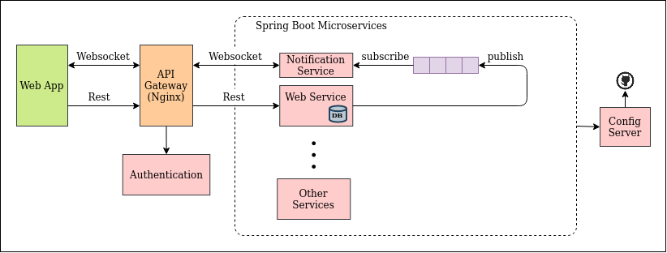

# Backend Architecture

This is the backend architecture for the java web app based on an **Event Driven Microservice Framework**.



## Folder Structure

**Note: Do ignore folders with asterisk as they are just experimental projects!!**

```
root
├── database                    # MongoDB
├── ms-config-server            # Centralized Config Server (Spring Boot Cloud)
├── ms-notification-service     # Web Socker Server (Spring Boot Micro-service)
├── ms-web-service              # Web Core Services (Spring Boot Micro-service)
├── rabbitmq                    # Message Queue
├── web-api-gateway-nginx       # API Gateway (Nginx)
├── web-api-gateway-node**      # API Gateway (Node)
└── ws-fake-api**               # Web Service (Node)
```

## Usage

### Localhost

1. Start the databases
    - Mongo (Fresh)
        - `cd database`
        - `cd mongodata`
        - `rm -rf *`
        - `cd ..`
        - `sudo docker-compose up -d`

2. Start API Gateway
    - `cd web-api-gateway-nginx`
    - `sudo docker build -t apigateway_image .`
    - `sudo docker run --name apigateway --net=host -d apigateway_image`

3. Start Config Server
    - `cd ms-config-server`
    - `./gradlew bootRun`

4. Start RabbitMQ
    - `cd rabbitmq`
    - `cd storage`
    - `rm -rf *`
    - `cd ..`
    - `sudo docker-compose up -d`
    
5. Start Microservices
    - Web Service
        - `cd ms-web-service`
        - `./gradlew bootRun`
    - Notification Service
        - `cd ms-notification-service`
        - `./gradlew bootRun`