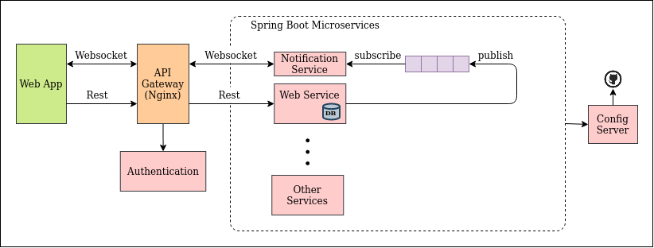

# Backend Architecture

This is the backend architecture for the java web app based on an **Event Driven Microservice Framework**.



Refer to the following documentation on the implementation of the various microservices:
- [Notification Microservice](ms-notification-service/doc/NOTIFICATION_SERVICE.md)
- [Web Microservice](ms-web-service)

## Folder Structure

**Note: Do ignore folders with asterisk as they are just experimental projects!!**

```
root
├── ms-notification-service     # Web Socker Server (Spring Boot Micro-service)
└── ms-web-service              # Web Core Services (Spring Boot Micro-service)
```

## Usage

### Localhost

1. Web Service
    ```bash
    cd <root>
    ./gradlew app-backend:ms-web-service:bootRun
    ```

2. Notification Service
    ```bash
    cd <root>
    ./gradlew app-backend:ms-notification-service:bootRun
    ```