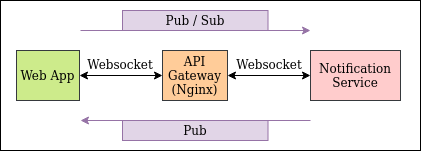
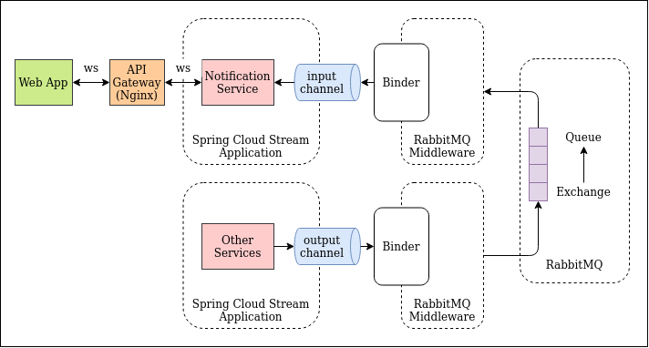

# Notification Service Design & Implementation

The notification service serves us a websocket server which communicates to connected client via **stomp over websocket**.

## WebSocket Server to Client communication

To build an interactive web client, we used stomp over websocket protocol to allow client and server to communicate 
with each other. **Note: SockJS support is not required unless we are trying to support older browser. Refer to 
[this](https://caniuse.com/websockets) to check websocket support in browsers**

- Client subscribe to a topic and listens for messages from server.
- Server publish message to topic which are picked up by clients.

### Topics

Refer to this table for the list of topics implemented for server to client communication.

| Topics | Remarks |
| --- | --- |
| /topic/announcement/new | web app (client) is subscribing to this topic and web-service will publish announcement to this topic whenever a new announcement is created |

## Other Server to Client communication

Notification Service is the main websocket server. Hence, for other microservices to communicate with the client, they 
will have to pass their message through Notification Service. This is implemented based on **"Event Driven Microservice 
Architecture"** using **Spring Cloud Stream** and **RabbitMQ** where other microservices publish their messages to a 
rabbitmq queue which will be consumed by the notification microservice and forwarded to the client.

