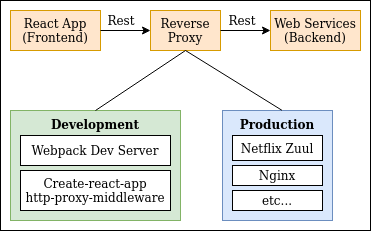

# Frontend / Web Interface (React)

The frontend is build primarily using **React** framework. Additional tech stack incldues the following:
- **Javascript Syntax**: Typescript / JSX / ES6
- **Javascript Module Bundler / Transpiler**: Webpack 5 / Babel / Rollup
- **Documentation / Playground**: Storybook
- **Testing**: Cypress / React Testing-library
- **Styling**: SASS / CSS Modules
- **Design Libraries**: ElasticUI / MaterialUI

**Table of Content**
- [Folder Structure](#folder-structure)
- [Design Concepts](#design-concepts)
    - [How to deploy frontend](#how-to-deploy-frontend)
- [Usage](#usage)
    - [Run the projects via localhost](#localhost)
    - [Run the projects via docker](#docker)
    - [Run the projects via kubernetes](#kubernetes)

## Folder Structure

There are multiple components that are being experimented. Refer to the folder structure before to know what each project
is about.

```
root
├── react-base-app              # Main web app
├── react-component-library     # Custom Reusable React Component Library
└── react-micro-frontend        # Sub web app that is consumes by main app  
```

## Design Concepts

### How to deploy Frontend

This section covers a some considerations made when deploying web applications. In order for web applications to communicate
to the backend services through Rest API, a reverse proxy is required (especially when there are multiple APIs). Below is 
an example of how a rest call to the backend is resolved.



As seen in the image above, during development process, React applications bundled using **webpack** have **webpack dev server** 
to proxy rest calls while in React applications created using **create-react-app**, there is **http-proxy-middleware**. Hence, 
when a rest call is made. Eg `fetch("/rest/user/info")`, the proxy middleware will then resolve these calls to the correct
backend services. In production, we will have to use something with reverse proxy features like **Nginx** or **Netflix Zuul**. Below
are two different designs for deploying Frontend.

#### Design 1: Frontend served in same webserver as Backend web service, Netflix Zuul for reverse proxy.


- All Rest call will be made to the Backend web service where **Netflix Zuul** will reverse proxy the request accordingly.

#### Design 2: Frontend served in nginx webserver, separated from Backend web service.


- All Rest call will be reverse proxy by the **Nginx reverse proxy configuration**.

## Usage

### Localhost

1. Build React Component Library
    - `cd react-component-library`
    - `yarn install --ignore-scripts`
    - `yarn run build`

2. Start React Micro Frontend
    - `cd react-micro-frontend`
    - `yarn install`
    - `yarn start`

3. Start the Main Frontend App
    - `cd react-frontend`
    - `yarn install`
    - `yarn start`

### Docker

1. Build the webapp
    - `sudo docker build -t webapp_image .`

2. Run the webapp
    - `sudo docker run --net=host -d --name webapp webapp_image`

### Kubernetes


## References

- [React is Docker built with multi stage docker builds including testing](https://medium.com/@tiangolo/react-in-docker-with-nginx-built-with-multi-stage-docker-builds-including-testing-8cc49d6ec305)
