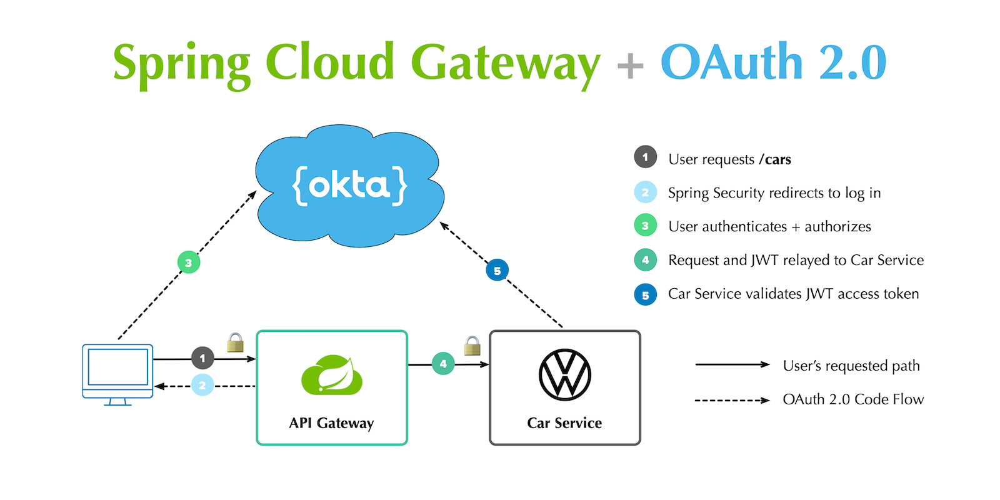

# API Gateway

An API Gateway acts as a single entry point for a collection of microservices. Any external client cannot access the 
microservices directly but can access them only through the application gateway. In a real world scenario an external 
client can be any one of the three:
- Mobile Application
- Desktop Application
- External Services or third party Apps

The **advantages** of having an API Gateway are as follows:
- Improves security as clients do not have direct access to microservices.
- Simplifies client interaction as he will only need to access a single service for all the requirement without knowing 
the internal architecture.
- As all request routes through here, we can implement authentication, rate limiting, monitoring and etc...

In general, an API Gateway is part of an API Management System. It can have the following **features**:
- Reverse Proxy
- Service Discovery
- Authentication
- Load Balancing
- Rate Limiting (prevent overuse / abuse)
- Analytics and Monitoring
- Caching

Using a diagram obtained from [okta](https://developer.okta.com/blog/2019/08/28/reactive-microservices-spring-cloud-gateway)
to explain the functionality of an API Gateway.



## Folder Structure

There are multiple components that are being experimented. Refer to the folder structure below to know what each project
is about.

```
root
├── api-gateway-nginx      # API Gateway built using Nginx
├── api-gateway-node       # API Gateway built using NodeJS + Express
├── api-gateway-spring     # API Gateway built using Spring Cloud Gateway
└── ws-fake-api            # API For Testing Purpose
```

## Key Concepts

### Service Discovery
