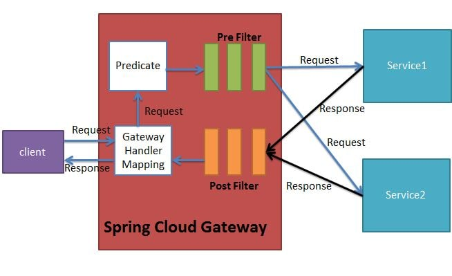

# Spring Cloud Gateway

Simple API Gateway to enable request rerouting. Possible responsibilities includes **authentication, monitoring, load
balancing, caching, request shaping and management, and static response handling**

## Usage

```bash
cd <root>
./gradlew app-gateway:api-gateway-spring:bootRun
```

## Key Concepts



### Route

Defined by a given identification (ID), a destination (URI) and a set of predicates and filters.

Note that URIs defined in routes without a port get default port values of 80 and 443 for the HTTP and HTTPS URIs, respectively.

### Predicates

n a nutshell, a Predicate in Spring Cloud Gateway is an object that tests if the given request fulfills a given condition. 
For each route, we can define one or more predicates that, if satisfied, will accept requests for the configured backend 
after applying any filters.

There are a couple of built-in predicate factories which we can use. Refer to documentation [here](https://cloud.spring.io/spring-cloud-gateway/reference/html/#gateway-request-predicates-factories).

### Filters

Spring Web Filters. The route filters make modification to incoming HTTP request or outgoing HTTP response based on what 
was defined. There are a couple of built-in WebFilter factories as well.

## References
- https://spring.io/blog/2019/07/01/hiding-services-runtime-discovery-with-spring-cloud-gateway
- https://www.javainuse.com/spring/cloud-gateway-eureka
- https://www.javainuse.com/spring/cloud-gateway
- https://www.javainuse.com/spring/spring-cloud-netflix-zuul-tutorial
- https://www.javainuse.com/spring/cloud-hystrix
- [Spring Cloud Kubernetes - Discovery Client](https://www.youtube.com/watch?v=icyHIjfgYRY)
- [Rewrite Path Filters](https://thetechstack.net/spring-cloud-gateway-part-2/)
- [Spring Cloud Gateway - Websockets](https://www.devglan.com/spring-cloud/spring-cloud-gateway-websockets)
- [Replacing Zuul with Spring Cloud gateway to access websocket](https://programming.vip/docs/replacing-zuul-with-spring-cloud-gateway-to-access-websocket.html)
