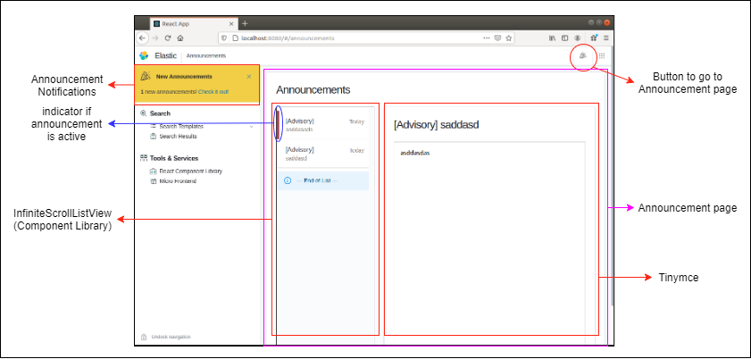
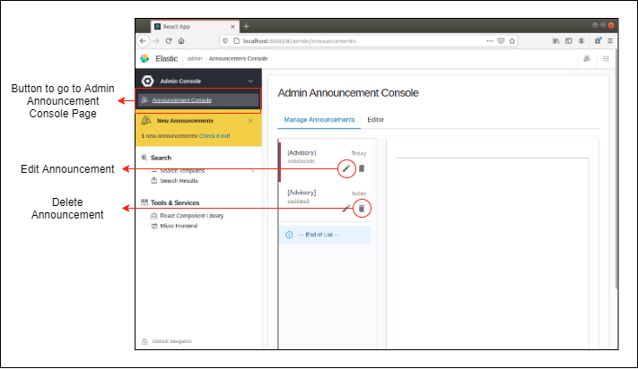
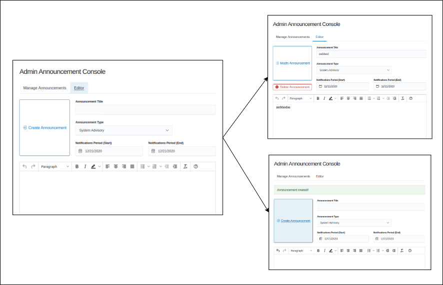

# Announcement Implementation for Frontend

Here are some background context for announcement feature:
1. There can be several active announcements
2. Announcements are stored inside database
3. There is an [**announcement service (API)**](../app-backend/ms-web-service/doc/ANNOUNCEMENT_SERVICE.md) inside [**web microservice**](../app-backend/ms-web-service)

## User View

- When a new announcement is created by the admin, the user will receive the **announcement notification via websocket**.
- **InfiniteScrollListView** is a custom component inside react-component-library. Refer to documentation for more details.
- **localStorage** is used to keep track of user have read the announcements. (key = `readAnnouncementIds`).

## Admin View

Admin have an admin announcement console to manage announcements
- create announcements (which will be active based on notification period)
- edit announcements
- delete announcements

