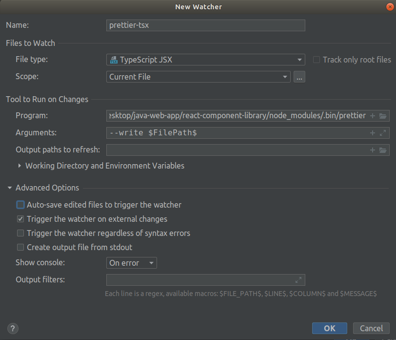
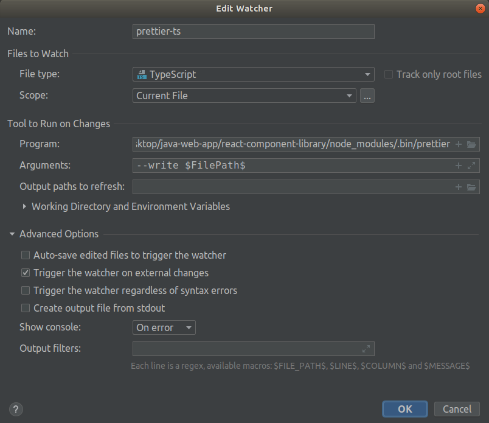
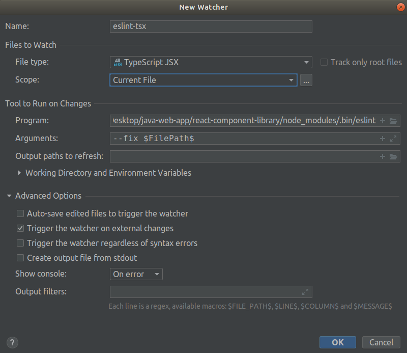
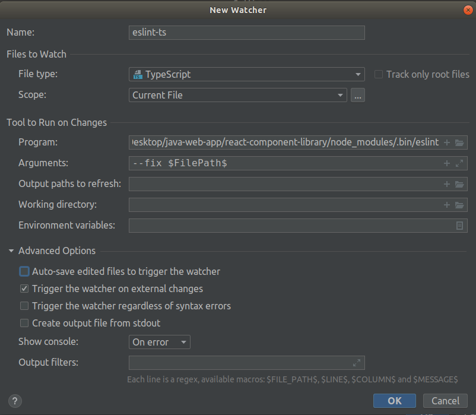

# Project Set up

## Environment set-up

To run the project, you will have to first install the following:

1. [Gradle](https://gradle.org/install/#manually)
2. [IntelliJ](https://www.jetbrains.com/help/idea/installation-guide.html#toolbox)
3. [Node-12](https://github.com/nodejs/help/wiki/Installation)
4. [Git](https://git-scm.com/book/en/v2/Getting-Started-Installing-Git)
5. [Java JDK 11](https://www.oracle.com/java/technologies/javase-jdk11-downloads.html)
6. [Docker](https://docs.docker.com/get-docker/)
7. [Docker-Compose](https://docs.docker.com/compose/install/)

## IntelliJ set-up

1. Import project into IntelliJ (select `build.gradle.kts` in the root directory)
2. Inside IntelliJ, update the following settings
    1. `File -> Settings -> Plugins -> Marketplace`. Search for `Filewatcher` plugin and install it.
    2. `File -> Settings -> Language & Framework -> Javascript`. Under `Javascript Language Version`, set to `React JSX`.
    3. `File -> Settings -> Language & Framework -> Javascript -> Code Quality Tools -> Eslint`. Check `Automatic ESLint Configuration`.
    4. `File -> Settings -> Language & Framework -> Typescript -> TSLint`. Check on `Automatic TSLint Configuration`.
3. Inside IntelliJ, set up Eslint / Prettier in Filewatcher to auto lint your frontend codes
    - 
    - 
    - 
    - 
